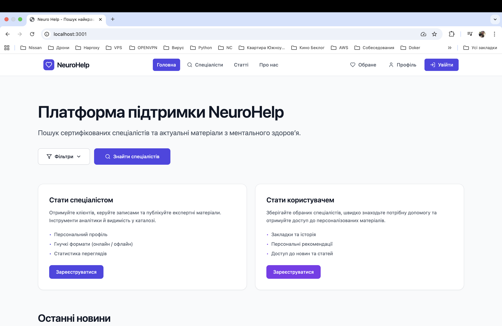

# Neuro Help

A content management system built with Go backend and React frontend, containerized with Docker. This CMS is specifically designed for psychology services platform with features for psychologists and clients.



## Project Structure

```
my-little-go-cms/
├── cmd/                  # Main application entrypoint
│   └── main.go
│
├── frontend/               # React frontend application
│   ├── src/
│   │   ├── components/    # Reusable UI components
│   │   ├── pages/        # Page components
│   │   ├── context/      # React context providers
│   │   ├── routes/       # Routing configuration
│   │   └── utils/        # Utility functions
│   ├── Dockerfile        # Frontend Docker configuration
│   └── package.json
│
├── internal/              # Go backend application
│   ├── db/               # Database configuration
│   ├── handlers/         # HTTP request handlers
│   ├── middleware/       # HTTP middleware
│   ├── models/          # Data models
│   └── utils/           # Utility functions
│
├── templates/             # Email templates
├── tests/                # Test files
│   ├── unit_tests/       # Unit tests for handlers
│   └── ...
│
├── Dockerfile           # Backend Docker configuration
├── docker-compose.yml   # Docker compose configuration
└── Makefile            # Build and test commands
```

## Features

### 🎯 Core Features
- **User Management**: Registration, authentication, profile management
- **Admin Panel**: Complete administrative interface
- **News Management**: Create, edit, publish news articles
- **Skills System**: Manage psychologist skills and categories
- **Portfolio System**: Psychologist portfolios with photo uploads
- **Review System**: Client reviews and ratings for psychologists
- **Blog System**: Psychologist personal blogs

### 👥 User Roles
- **Clients**: Can register, create profiles, leave reviews
- **Psychologists**: Can manage portfolios, skills, blog posts
- **Administrators**: Full system management access
- **Moderators**: Limited admin access
- **Master**: Super admin with all permissions

### 📊 Admin Features
- User management (create, update, delete, status control)
- News management (create, edit, publish, home page display)
- Skills and categories management
- Subscription plans management
- Administrator management
- System analytics and statistics

### 🔧 Technical Features
- **Authentication**: JWT-based authentication
- **File Upload**: Image upload for portfolios
- **Email Verification**: User email verification system
- **WYSIWYG Editor**: Rich text editor for content creation
- **Responsive Design**: Mobile-friendly interface
- **API Documentation**: Swagger/OpenAPI documentation

## Prerequisites

- Docker and Docker Compose
- Git

## Local Development Setup

1. Clone the repository:
```bash
git clone https://github.com/yourusername/my-little-go-cms.git
cd my-little-go-cms
```

2. Create and configure environment files:

For backend (`.env`):
```env
DB_HOST=mysql
DB_PORT=3306
DB_USER=testuser
DB_PASSWORD=testpass
DB_NAME=testdb
JWT_SECRET=your_secret_key
ADMIN_EMAIL=admin@example.com
ADMIN_PASSWORD=admin_password
```

For frontend (`frontend/.env`):
```env
REACT_APP_API_URL=http://localhost:8080
```

3. Build and start the containers:
```bash
docker-compose up --build
```

The application will be available at:
- Frontend: http://localhost:3000
- Backend API: http://localhost:8080
- Swagger Documentation: http://localhost:8080/swagger/index.html

### Running Frontend Locally (without Docker)

If you want to run only the frontend for development, follow these steps:

1.  **Navigate to the `frontend` directory:**
    ```bash
    cd frontend
    ```

2.  **Install dependencies:**
    ```bash
    npm install
    ```

3.  **Start the development server:**
    ```bash
    npm run dev
    ```
    The frontend will be available at the address shown in the terminal (usually `http://localhost:5173`). Note that for the application to work fully, the backend must also be running (e.g., via Docker).

## Docker Commands

Build and start containers:
```bash
docker-compose up --build    # Build and start all services
docker-compose up -d         # Run in detached mode
```

Stop containers:
```bash
docker-compose down          # Stop all services
```

View logs:
```bash
docker-compose logs -f       # Follow logs from all services
docker-compose logs frontend # View frontend logs
docker-compose logs go-api   # View backend logs
```

Restart specific service:
```bash
docker-compose restart frontend   # Restart frontend
docker-compose restart go-api     # Restart backend
```

## Testing

The project includes a comprehensive test suite using Go's native testing package and `testify/suite`.

```bash
# Run all tests
make test

# Or run tests for a specific package
go test ./tests/unit_tests/...

# Run tests with coverage report
make test-coverage

# Run tests with race condition detection
make test-race
```

## API Documentation

The API documentation is available through Swagger UI at http://localhost:8080/swagger/index.html when running locally.

### Main API Endpoints

#### Authentication
- `POST /api/login` - User login
- `POST /api/register` - User registration
- `GET /api/verify` - Email verification
- `POST /api/auth/refresh` - Refresh JWT token

#### Admin Operations
- `GET /api/admin/users` - List all users
- `POST /api/admin/users` - Create user
- `PUT /api/admin/users/{id}` - Update user
- `DELETE /api/admin/users/{id}` - Delete user

#### News Management (Admin)
- `GET /api/admin/news` - List all news
- `POST /api/admin/news` - Create news
- `PUT /api/admin/news/{id}` - Update news
- `DELETE /api/admin/news/{id}` - Delete news

#### Public News
- `GET /api/news` - Public news list
- `GET /api/news/{id}` - Get specific news
- `GET /api/news/home` - News for home page

#### Skills Management (Admin)
- `GET /api/admin/skills` - List skills
- `POST /api/admin/skills` - Create skill
- `PUT /api/admin/skills/{id}` - Update skill
- `DELETE /api/admin/skills/{id}` - Delete skill
- `GET /api/admin/skills/categories` - List skill categories
- `POST /api/admin/skills/categories` - Create skill category
- `PUT /api/admin/skills/categories/{id}` - Update skill category
- `DELETE /api/admin/skills/categories/{id}` - Delete skill category

#### User Profile, Portfolio & Skills
- `GET /api/users/self` - Get own profile
- `PUT /api/users/self/updateuser` - Update own profile
- `GET /api/users/{id}` - Get any user's public profile
- `PUT /api/users/self/portfolio` - Create/Update portfolio
- `POST /api/users/portfolio/photo` - Upload portfolio photo
- `DELETE /api/users/portfolio/photo/{photo_id}` - Delete portfolio photo
- `PUT /api/users/self/skills` - Set own skills
- `GET /api/users/skills` - Get all skills grouped by category
- `GET /api/users/{user_id}/skills` - Get a specific user's skills

#### Blog System
- `POST /api/users/blog` - Create a blog post
- `GET /api/users/blog/{psychologist_id}` - Get all posts by a psychologist
- `GET /api/users/blog/post/{blog_id}` - Get a single blog post
- `PUT /api/users/blog/post/{blog_id}` - Update a blog post
- `DELETE /api/users/blog/post/{blog_id}` - Delete a blog post

#### Reviews & Ratings
- `POST /api/reviews/{psychologist_id}` - Create a review for a psychologist

## Development Workflow

1. Make changes to the code
2. Rebuild and restart the containers:
```bash
docker-compose down
docker-compose up --build
```

### Frontend Development

The frontend is built with:
- **React 18** with TypeScript
- **Tailwind CSS** for styling
- **React Router** for navigation
- **Context API** for state management
- **Vite** for build tooling
- **WYSIWYG Editor** for rich text editing

Key frontend features:
- Responsive design for all devices
- Admin dashboard with statistics
- User profile management
- News and blog management
- Image upload and management
- Real-time form validation

### Backend Development

The backend is built with:
- **Go 1.21+** with Chi router
- **GORM** for database ORM
- **JWT** for authentication
- **MySQL** as database
- **Swagger** for API documentation
- **Docker** for containerization

Key backend features:
- RESTful API design
- Role-based access control
- File upload handling
- Email verification system
- Database migrations
- Comprehensive logging

## Database Schema

The system uses MySQL with the following main tables:
- `users` - User accounts and profiles
- `administrators` - Admin accounts
- `news` - News articles
- `skills` - Psychologist skills
- `categories` - Skill categories
- `portfolios` - Psychologist portfolios
- `photos` - Portfolio photos
- `reviews` - Client reviews
- `ratings` - Psychologist ratings
- `blog_posts` - Blog articles
- `plans` - Subscription plans
- `psychologist_skills` - Join table for users and skills

## Security Features

- JWT-based authentication with refresh tokens
- Password hashing with bcrypt
- Email verification for new accounts
- Role-based access control
- Input validation and sanitization
- CORS configuration
- Rate limiting (recommended for production)

## Production Deployment

For production deployment:

1. Update environment variables for production
2. Configure SSL/TLS certificates
3. Set up reverse proxy (nginx recommended)
4. Configure database backup strategy
5. Set up monitoring and logging
6. Configure email service for notifications

## Troubleshooting

If you encounter issues:

1. Check container status:
```bash
docker-compose ps
```

2. View container logs:
```bash
docker-compose logs -f
```

3. Rebuild containers:
```bash
docker-compose down
docker-compose up --build
```

4. Check database connection from within the container.

5. Reset database (development only):
```bash
docker-compose down -v
docker-compose up --build
```

## Contributing

1. Fork the repository
2. Create a feature branch
3. Make your changes
4. Run tests: `make test`
5. Submit a pull request

## License

MIT License - see LICENSE file for details

## Support

For support and questions:
- Create an issue in the GitHub repository
- Check the API documentation at `/swagger/index.html`
- Review the test files in `tests/unit_tests/` for usage examples